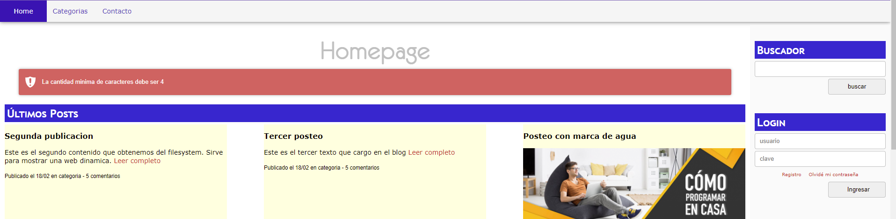

### Manipulación de los contenidos de los String

_Calcula Cadenas de texto_

- Podemos saber si la cantidad de caracteres que tiene un string por medio de la funcion `strlen($texto)`

- De la misma manera podemos obtener la cantidad de palabras que hay en una oracion por medio de `str_word_count($texto)`

