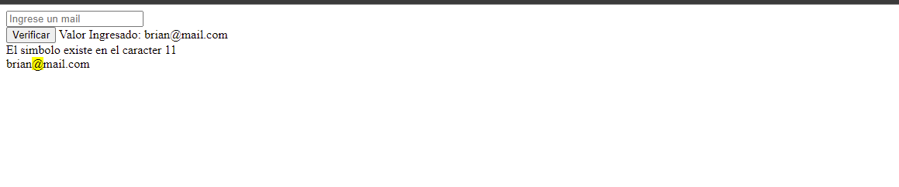

### Buscar y reemplazar cadenas de texto

<table align="center">
  <tr>
    <td align="center" style="padding=0;width=50%;">
      
    </td>
  </tr>
</table>

_Buscar en un String_

- PAra buscar dentro de una cadenas de texto un determinado contenido se usa la funcion `strpos()` que recibe dos argumetos:

>- En que cadenas de texto 
>- Que estamos buscando 

- Si existe, devuelve numero que representa la ubicacion dentro del String.
- el primer caracter del Strinf es el valor 0(cero).
- Si no existe coincidencia devuelve false
- False y 0 se comportan como el mismo valor, comparar con triple igual.

### Reemplazar textos

- para reemplazar valores se usa la funcion `str_replace` que recibe tres argumentos:

> - Que estamos bucando
> - Que ponemos en ese lugar
> - En que cadena de texto
