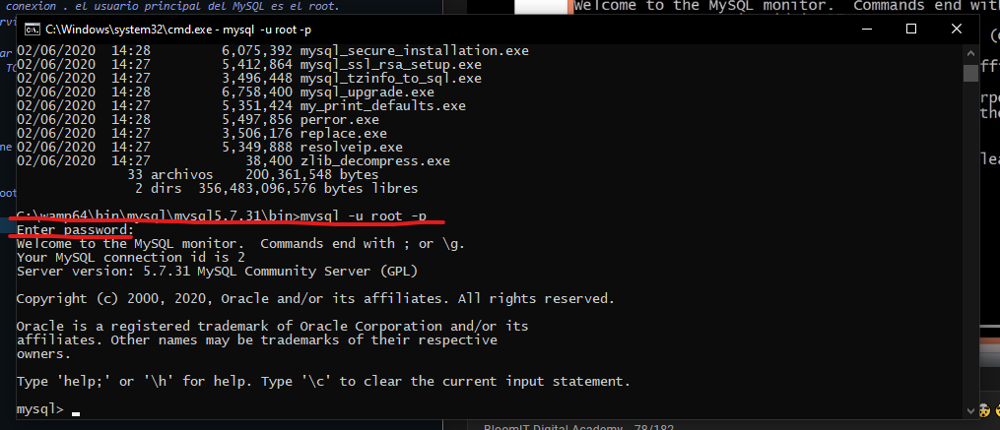
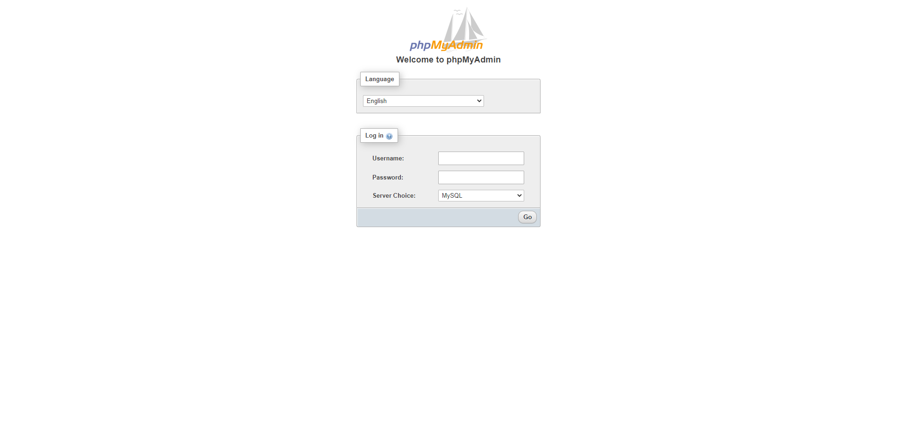
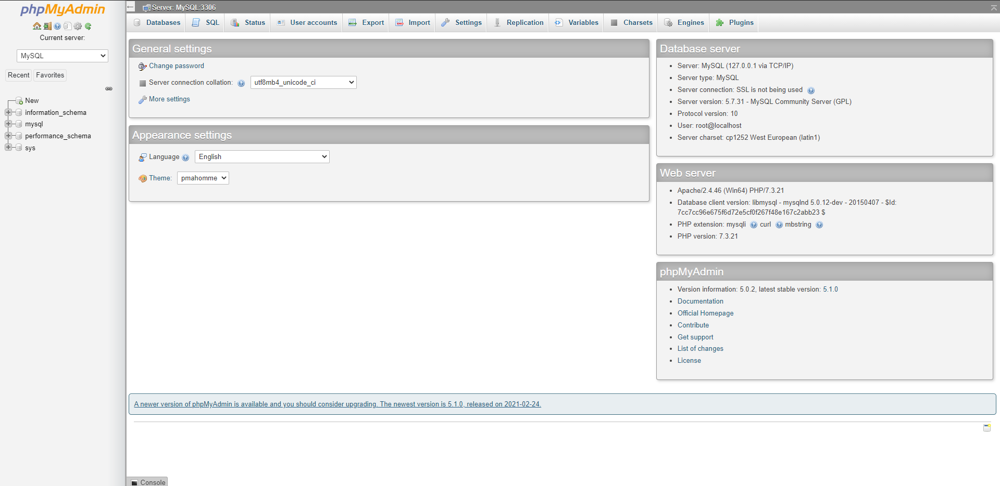
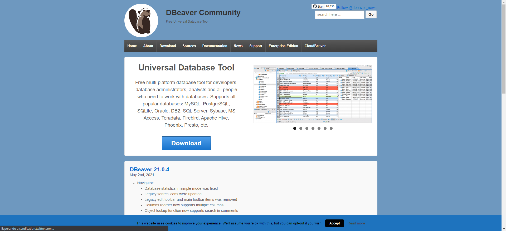

### Conectarse al SQL

- Como ya sabemos la base de datos es un servicio que tiene una capa de seguridad en el acceso.

- La herramienta DBA y PHP, deberan autentificarse para interactual con el SQL.
- Eso se hace con un usuario y clave que es propio del servicio

### Credenciales de acceso

- Cualquiera sea el mecanismo, la conexion al servior MySQL requiere 4 datos:

> El usuario de conexion . el usuario principal del MySQL es el root.
> Segundo el servidor de prueba, la contraseña esta vacia o es nuvamente root.
> Se debe indicar en que IP o dominio esta la base de datos
> ver el puerto TCP/IP 3306.


### EL CLI

- El Command Line Interfaz, es la interfaz desde consola.

```powershell
     mysql -u root -p
```
<table align="center">
  <tr>
    <td align="center" style="padding=0;width=50%;">
      
    </td>
  </tr>
</table>
 

- Una ves dentro, escribiremos SQL tal como se verá

```powershell
     show databases;
```

### PHP My Admin

- Es un micrositio hecho en php, que lo tienen instalado en la mayoria de hostings.

*User: root
*Password: 

<table align="center">
  <tr>
    <td align="center" style="padding=0;width=50%;">
      
    </td>
  </tr>
</table>

 
 <table align="center">
  <tr>
    <td align="center" style="padding=0;width=50%;">
      
    </td>
  </tr>
</table>

### Software de manipulacion

- Los Programas instalables es las PC del usuario logicamente mas agiles y pueden ofrecer herramientas visuales mas intuitivas.

- [DBeaver Comunity](https://dbeaver.io/)

 <table align="center">
  <tr>
    <td align="center" style="padding=0;width=50%;">
      
    </td>
  </tr>
</table>

 <table align="center">
  <tr>
    <td align="center" style="padding=0;width=50%;">
      
    </td>
  </tr>
</table>