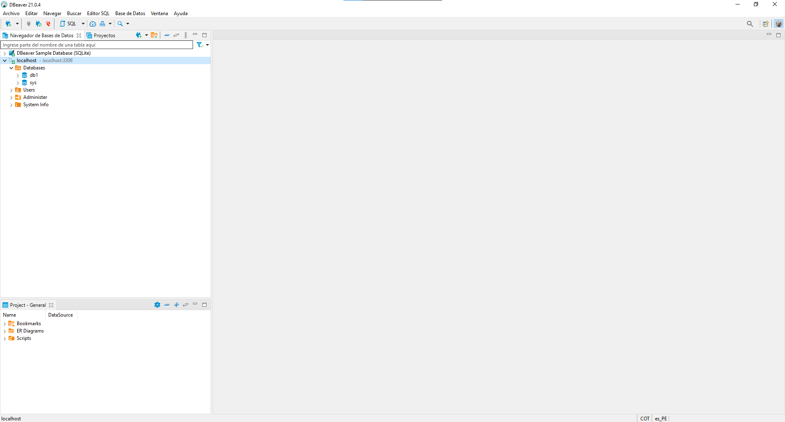

### Tablas y Columnas de una DB

- Sin Importar las herramienta ue usremos estableceremos un conexion con el servidor MYSQL para manipular las bases de datos y sus tablas.

### Crear la base de datos

- Una ves que estemos conectados, veremos el listado de las bases de datos que ya tenemos creadas

- Se asume que por cada plataforma a desarrollar necesitamos un base de datos, por lo cual vamos a crear un test.

<table align="center">
  <tr>
    <td align="center" style="padding=0;width=50%;">
      
    </td>
  </tr>
</table>


_Crear tabla_
```sql
  create new database
```

## Character set y Collation

- El `character set` es el conjunto de caracteres a usar, es equivalente al <meta charset="" /> de html.
- E suan traduccion interna del motor , de cada simbolo al codigo que lo representa.

- El `collation` son todas las reglas internas del motor a la hroa de comprar los carcteres.

  >Si la comparacion será case sensitive( todos lo sufijos _cs)