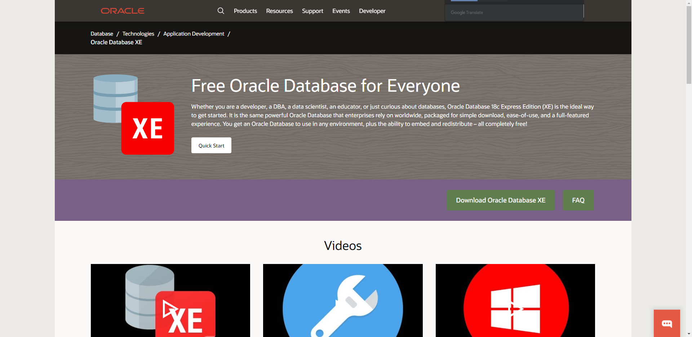
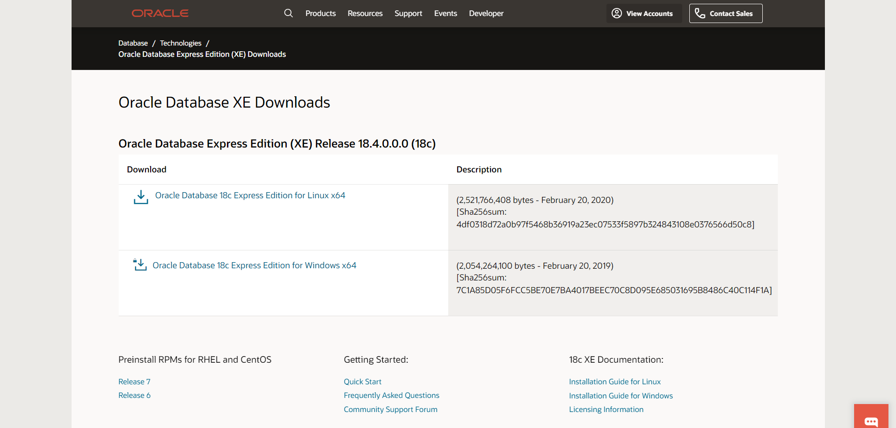
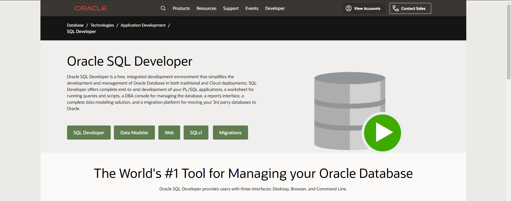
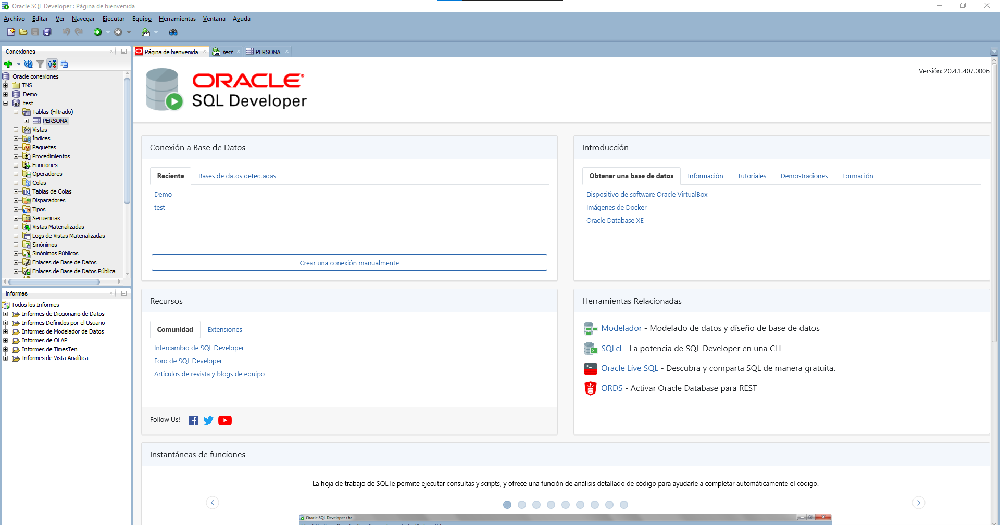
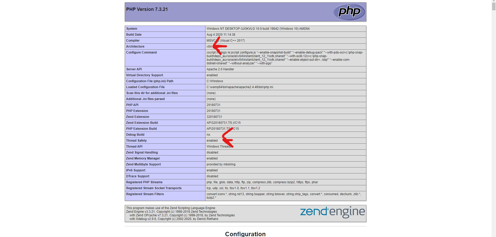
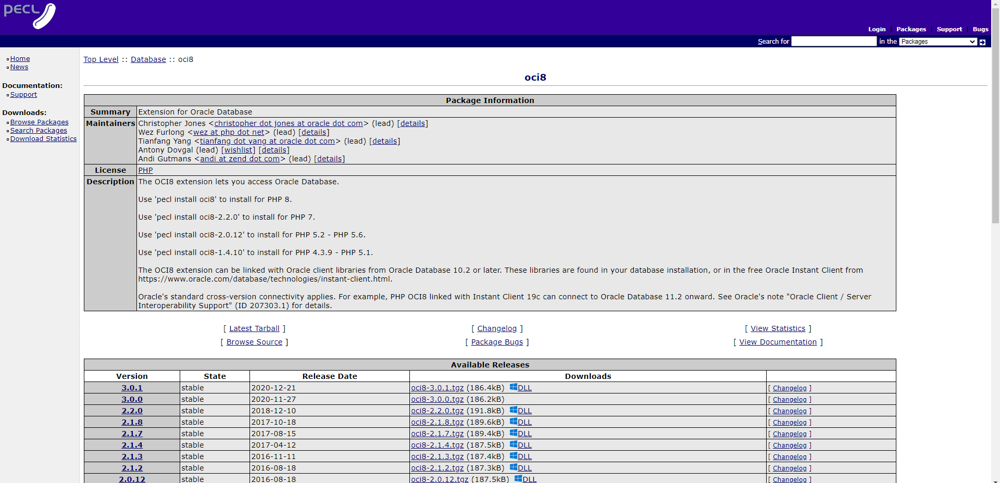
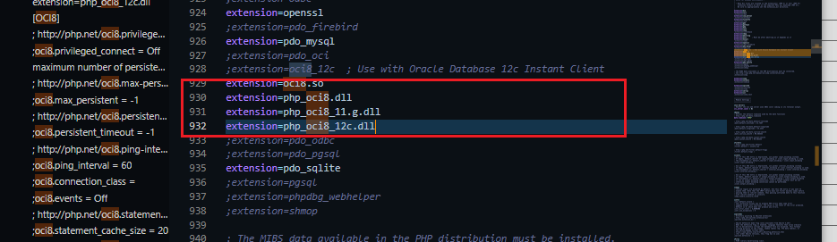
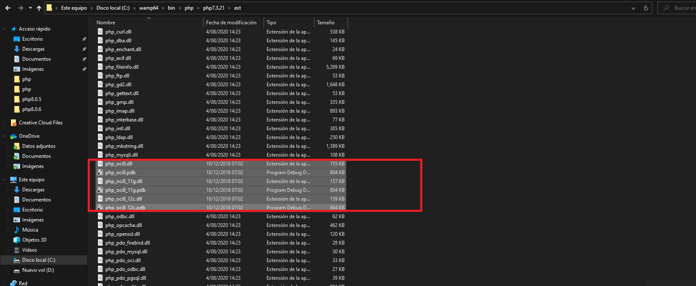
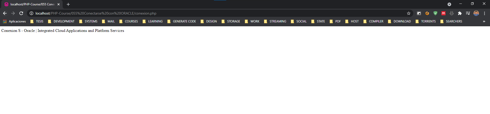

### Conectarse con Oracle

_Descargar Oracle XE_

<table align="center">
  <tr>
    <td align="center" style="padding=0;width=50%;">
      
    </td>
  </tr>
</table>

_Descargarr e Instalar_

<table align="center">
  <tr>
    <td align="center" style="padding=0;width=50%;">
      
    </td>
  </tr>
</table>

_Creacion de Usuario por la consola SQL PlUS_

**Ingresar modo admin en pasword presionar ENTER**

```sql
Introduzca el nombre de usuario: CONN /AS SYSDBA
Introduzca la contrase±a: /*ENTER*/
```

** Ver los Usuarios ***

```sql
show user;
```

** Eviamos el Errir ORA-65096 **

```sql
ALTER SESSION SET "_ORACLE_SCRIPT" = TRUE
```

** Creamos Usuario **

```sql
CREATE USER users IDENTIFIED BY password
```

** Briandomos Admin **

```sql
GRANT DBA TO briandb;
```

_Ejecucion SQL DEVELOPER_

<table align="center">
  <tr>
    <td align="center" style="padding=0;width=50%;">
      
    </td>
  </tr>
</table>

_Descargar SQLDeveloper_

<table align="center">
  <tr>
    <td align="center" style="padding=0;width=50%;">
      
    </td>
  </tr>
</table>

_Instalar, Ejecular y Conectarse a la Instancia_

<table align="center">
  <tr>
    <td align="center" style="padding=0;width=50%;">
      
    </td>
  </tr>
</table>

_Crear la carperta `info.php` en la carpeta raiz de wamp_

_ En la carpeta ingresar el seguiente codigo:

```php
<?php
    phpinfo();
?>
```

_Ejecuta por el navegador_

<table align="center">
  <tr>
    <td align="center" style="padding=0;width=50%;">
      
    </td>
  </tr>
</table>

- Architecture	x64
- Thread Safety	enabled

_Descargar OCI8.DLL_

[Pecl.php](https://pecl.php.net/package/oci8/2.2.0/windows)

<table align="center">
  <tr>
    <td align="center" style="padding=0;width=50%;">
      
    </td>
  </tr>
</table>


_PHP.INI habilitar y agregar extenciones_

extension=oci8.so
extension=php_oci8.dll
extension=php_oci8_11.g.dll
extension=php_oci8_12c.dll

*éste es el dll para poder hacer la conexión con PDO*
(Si quieren usar pdo simplemente usen éste, si les da igual, lo agregan o no)


<table align="center">
  <tr>
    <td align="center" style="padding=0;width=50%;">
      
    </td>
  </tr>
</table>


_Copiar los DDL a la carperta de WAMP_

C:\wamp64\bin\php\php7.3.21\ext

<table align="center">
  <tr>
    <td align="center" style="padding=0;width=50%;">
      
    </td>
  </tr>
</table>

_Descargar Cliente Oracle_

[Oracle Instant Client Downloads](https://www.oracle.com/database/technologies/instant-client/downloads.html)

- Crear una carpeta llama Oracle en el disco C 
- Pegar todo el contenido de la carpeta descargada
- Agregar la ruta al Path
- Reiniciar la PC

<table align="center">
  <tr>
    <td align="center" style="padding=0;width=50%;">
      
    </td>
  </tr>
</table>


_Porbando la Coneccion_

```php
<?php
//*Conectar con OCI (el que se usó en el vídeo)*
$Oracle = oci_connect("briandb", "briandb", "localhost/XE");
if($Oracle ){
    echo 'Conexion S - Oracle | Integrated Cloud Applications and Platform Services';
}else{
    echo 'Conexion Fallida';
}
?>
```

<table align="center">
  <tr>
    <td align="center" style="padding=0;width=50%;">
      
    </td>
  </tr>
</table>
