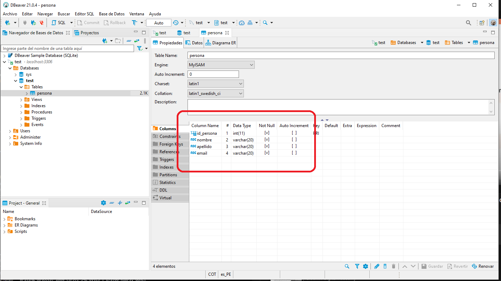

### Anchura del tipo de datos MySQL

-  Algunos tipo de datos permiten indocar ente parentesis un valor numerico que representa la Anchura dle tipo de datos seleccionado.

<table align="center">
  <tr>
    <td align="center" style="padding=0;width=50%;">
      
    </td>
</tr>
</table>

-Tecnicismos_

Unicamente es obligatorio en char, varcharm float y el resto de los tipo de datos si bien lo aceptan no es requerido.

- En las Fechas bi aw swbw indicar
- En los casos de Aray(set y num) los parentesis se usan para definir (separados por coma) las opciones disponibles