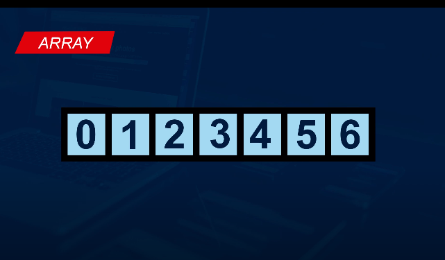

## Array
### Espacios en Memoria

- Una Variable es un espacio en la memoria que almacena un dato y tiene un nombre que lo referencia.
- Una Funcion es un espacio en una momoria que tambien tiene un nombre referencial, pero almacena una secuancia de pasos.
- un array es un espacio en la memoria con un nombre que lo referencia.




It's preferable to install it globally through [`npm`](https://www.npmjs.com/package/git-release-notes)

    npm install -g git-release-notes

It's also possible to use `git-release-notes` as a node module. Check the usage on [usage as a module](#Usage_as_a_module)

#### Post Processing

The advanced options cover the most basic use cases, however sometimes you might need some additional processing, for instance to get commit metadata from external sources (Jira, GitHub, Waffle...)

Using `-s script_file.js` you can invoke any arbitrary node script with the following signature:

```js
module.exports = function(data, callback) {
  /**
   * Here `data` contains exactly the same values your template will normally receive. e.g.
   *
   * {
   *   commits: [], // the array of commits as described above
   *   range: '<since>..<until>',
   *   dateFnsFormat: function () {},
   *   debug: function() {}, // utility function to log debug messages
   * }
   *
   * Do all the processing you need and when ready call the callback passing the new data structure
   */
  callback({
    commits: data.commits.map(doSomething),
    extra: { additional: 'data' },
  });
  //
};
```
