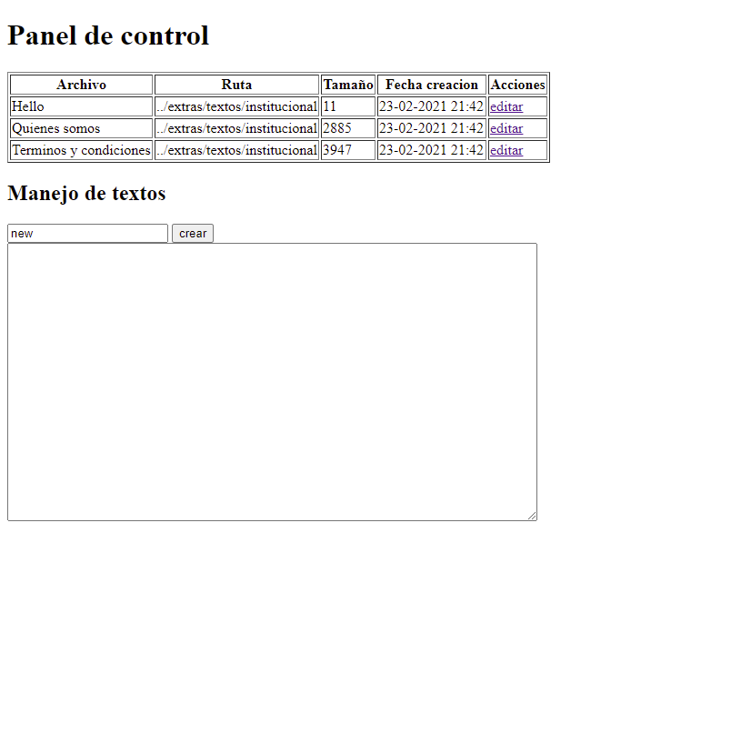

### Informacion de los archivos

- Podemos obtener el tamaño de un archivo con la funcion <strong>filesize()</strong>
- Para obtener la fecha de la creacion usamos la funcion <strong> filemtime() </strong> que devuelve un valor el formato Epoch.
- Podemos Obtener informacion puntual de un archivo con la funcion pathinfo()
- lA Funcion <strong>dirname()</strong> permite obtener la ruta donde se encuentra el archivo ppasado como argumento.
Acepta la constante __FILE__ para obtener la informacion del archivo actual.

