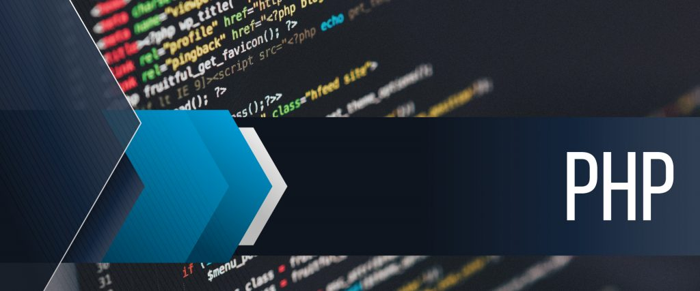
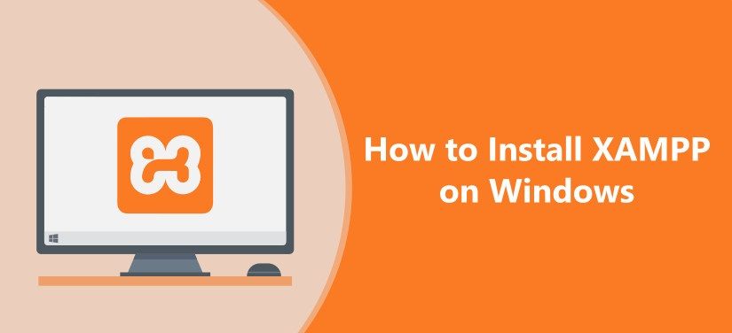

<h2 align="center">PHP Course - Learn PHP &nbsp;:heart:&nbsp;</h2>

  
  
  
    

  

## ¿Que es PHP? 💻

PHP (acrónimo recursivo de PHP: Hypertext Preprocessor) es un lenguaje de código abierto muy popular especialmente adecuado para el desarrollo web y que puede ser incrustado en HTML.

* [PHP](https://www.php.net/downloads.php)
* [MYSQL](https://www.mysql.com/downloads/)

## Cualidades

- Desarrollo de web dinamico
- No tiene costo
- Multiplataforma
- Servicio Automatizado

## Desarrollo Web

| LADO DEL CLIENTE                                             |     LADO DEL SERVIDOR            |  
|--------------------------------------------------------------|:--------------------------------:|
| HTML                                                         |PHP                               |    
| CSS                                                          |PHP                               | 
| JAVASCRIPTS                                                  |PHP                               |       

## SERVIDORES

## La Web Dinamica
 
- Una Página web dinámica genera su contenido según la petición de un usuario o contexto de la misma.
- Todo desde la programación (con las estructura y funciones del lenguaje)
- La Información accedida puede administrarse desde una base de datos.

## Servidores 📦

_Paquetes instaladores servidores_

* [WAMP](https://sourceforge.net/projects/wampserver/) - WampServer es una plataforma de desarrollo web en Windows que le permite crear aplicaciones web dinámicas con Apache2, PHP, MySQL y MariaDB. 
* [MAMP](https://www.mamp.info/en/downloads/) - MAMP instala un entorno de servidor local en cuestión de segundos en su computadora Windows o macOS. MAMP es gratuito y se instala fácilmente.
* [XAMP](https://www.apachefriends.org/download.html) - XAMPP es una distribución de Apache fácil de instalar que contiene MariaDB, PHP y Perl. Simplemente descargue e inicie el instalador. Es fácil.

## Servidor portable

* [ZWAMP (Portable oficial, Windows)](https://sourceforge.net/projects/zwamp/) - Un paquete de servidor web ligero de instalación cero que se ejecuta en Windows. El proyecto tiene como objetivo proporcionar las últimas versiones de producción / estables de Apache, MySQL, PHP, Adminer, MongoDB, MemCached, SQLite, eAccelerator y Alternative PHP Cache (APC) para impulsar el rendimiento del servidor.
* [ZWAMP alterado (No oficial)](https://github.com/BrianMarquez3/PHP-Course/blob/main/Resources/zwamp%20portable.rar/) - Un paquete Portable Modificado

