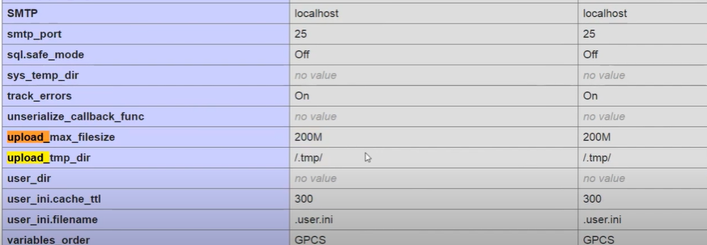

### Upload de archivos con formularios

- Para subir Archivos al servidor se usa <strong> input </strong> de tipo file
- Pero el formulario debe enviarse por POST y tener ENCTYPE con el valor MULTIPART/FROM-DATA
- Aunque noi procesemos el archivo, en realidad se sube al servidor (tmp)
- Este archivo se elimina automaticamente al finalizar de ejecutarse el codigo PHP

### Restricciones

- Por defecto el PHP.ini tiene seteado un limite de tamaño maximo de archivo
- Segun la version del servidor isntalado puede ser de 2mb hasta los 64mb
- Generalmente los hosting soportan archis mas grandes
- Si usamos las funcion PHPINFO() para ver la configuracion del php.ini, debemos buscar la directiva UPLOAD_MAX_FILESIZE

