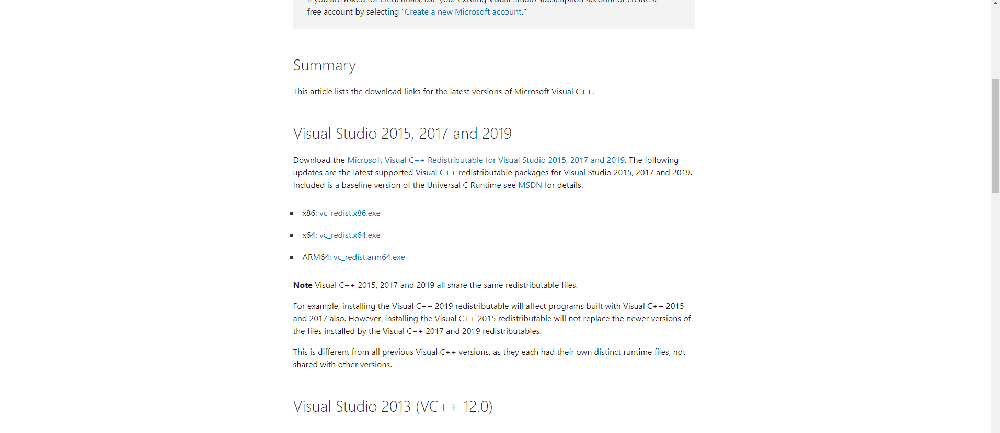
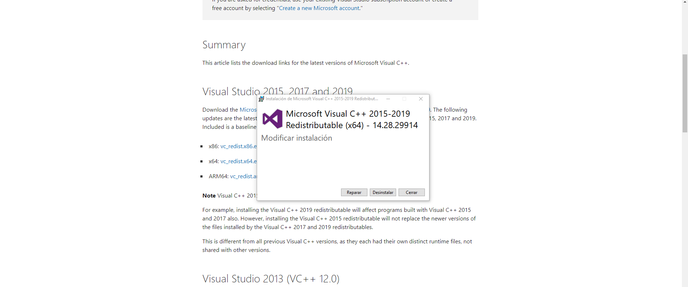

## Instalar PHP 8

- Tutorial para Instalacion [Myonlineedu](https://www.myonlineedu.com/blog/view/16/how-to-update-to-php-8-in-wamp-server-localhost)

<table align="center">
  <tr>
    <td align="center" style="padding=0;width=50%;">
      
    </td>
  </tr>
</table>

<table align="center">
  <tr>
    <td align="center" style="padding=0;width=50%;">
      
    </td>
  </tr>
</table>